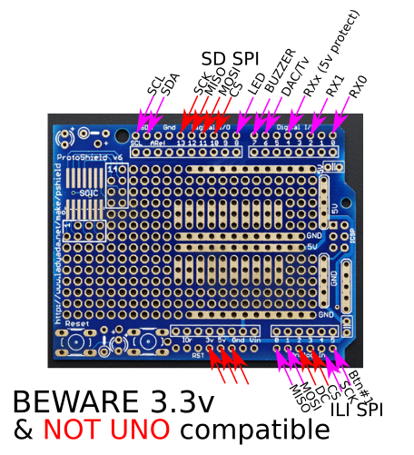
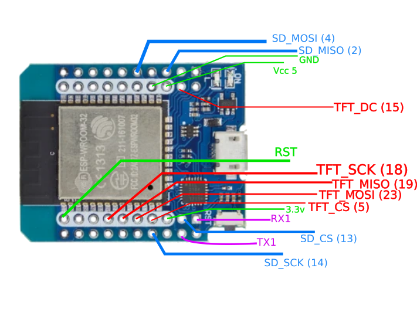

# XtsTiESP

Xtase - fgalliat @Aug 2020

- try tu reuse a Ti92(model  1-no asm) as Keyboard for an ESP32 + ILI9341 + SDCard
- it uses my other project : https://github.com/fgalliat/XtsTiLink_gh.git (for the calc & link part)
- **libraries :** 

  - SdFat
  - TFT_eSPI

  - TFT_eSPI (with custom config see ./libs)
- **hardware :**
  - ESP32 mini
  - Adafruit ProtoShield (for UNO)
  - ILI9341
  - SDCard reader
  - Buzzer
  - -- Ti92 / Arduino ProMini 5v (328P) --

- **devboard :**
  - **TODO:**
    - [x] Board wiring diagram
    - [ ] test SDCard custom SPI config
    - [ ] test all UARTs (0, 1, x)
    - [ ] protect SerialX from 5v logic (switchable)

  - **Diagram :**

    - DevBoard **!! NOT UNO Compatible !!**

    

    - ESP32 mini (HW665)

      