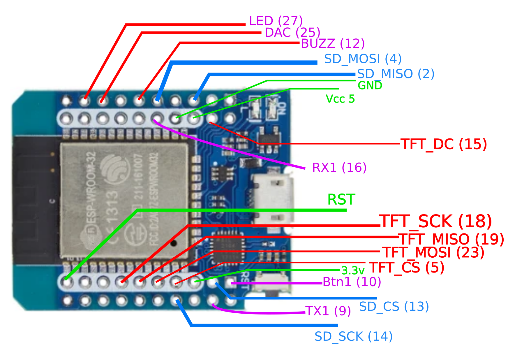

# XtsTiESP

Xtase - fgalliat @Aug 2020

- try tu reuse a Ti92(model  1-no asm) as Keyboard for an ESP32 + ILI9341 + SDCard

- it uses my other project : https://github.com/fgalliat/XtsTiLink_gh.git (for the calc & link part)

- **libraries :** 

  - SdFat
  - TFT_eSPI

- **hardware :**
  - ESP32 mini
  - Adafruit ProtoShield (for UNO)
  - ILI9341
  - SDCard reader
  - Buzzer / LED
  - -- Ti92 / Arduino ProMini 5v (328P) --

- **devboard :**
  - **TODO:**
    - [x] Board wiring diagram
    - [ ] Soldering
      - [x] SCL & SDA
      - [x] maybe Aref to Vcc (SCL,SDA,Vcc,GND ~kinda GROVE)
      - [ ] 8pins headers for Screen on lower-board
      - [x] SDCard Reader on upper board / cut pins @ bottom
      - [x] SDCard to SPI SD (**test it - code wrote**)
      - [ ] Screen SPI missing solders (MISO,MOSI, SCK)
      - [ ] some solders between lower & upper boards
      - [ ] SPI Screen just next SPI 8pins headers (**test it**)
    - [x] test SDCard custom SPI config
    - [ ] test ILI custom SPI config
    - [ ] test all UARTs (0, 1, x)
    - [x] protect SerialX from 5v logic (switchable)
    - [x] BUZZER / LED

  - **Diagram :**

    - DevBoard **!! NOT UNO Compatible !! (even if same form factor)**

    

    - ESP32 mini (HW665) (Arduino IDE : **WEMOS D1 MINI ESP32**)

      

- **ideas :**

  - webServer w/ DnD + UPLOAD
    - in progress
    - secure POST request w/ a token (~AUTH form)
  - BT Server / HID Server